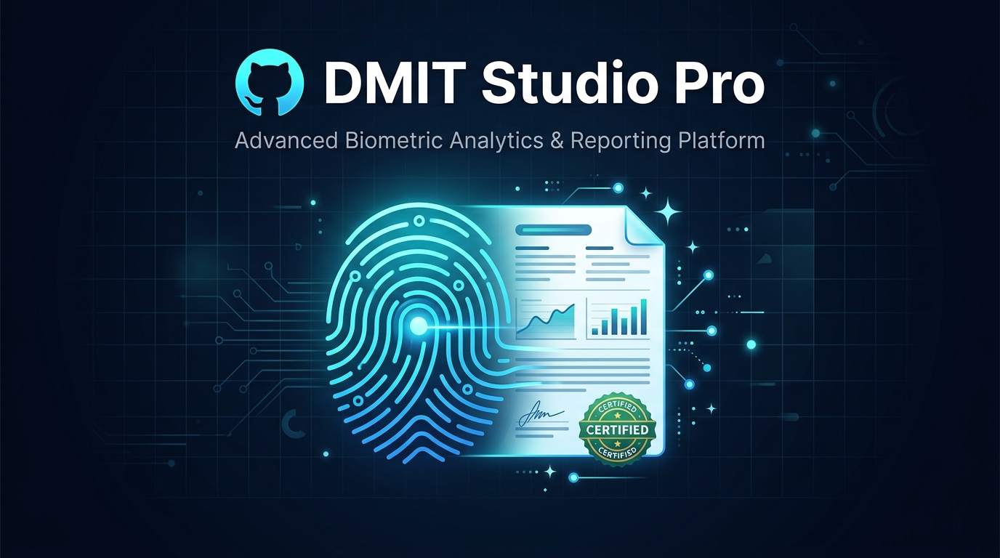

<p align="center">
  
</p>

# DMIT Studio Pro ✦ Report Re-Branding Engine

[](https://www.python.org/)
[](https://streamlit.io/)
[](LICENSE)

An automated white-labeling and re-branding engine for Dermatoglyphics Multiple Intelligence Test (DMIT) reports. Seamlessly transform standard vendor `.xlsm` and `.pdf` reports into fully custom-branded collateral with your clinic or consultancy's logo, typography, contact details, and global page footers.

---

## ✨ Features

- **Dual-Engine Processing**:
  - **Excel (`.xlsm`)**: Unpacks OpenXML archives to surgically replace cover media and update XML text nodes while preserving macros and formulas.
  - **PDF (`.pdf`)**: Redacts original cover logos and applies typographic replacements across all 69+ report pages using PyMuPDF.
- **Dynamic Composite Banner**: Automatically creates an aligned `Logo → Clinic Name → Email → Phone` cover graphic via Pillow with live browser preview.
- **Global Multi-Page Footers**: Replaces vendor disclaimers, contact numbers, and support emails across every single page.
- **Multi-Format Export**: Generates branded `.xlsm`, exports to `.pdf` (via headless LibreOffice), and converts PDF to editable Word `.docx`.
- **Modern Web Interface**: Intuitive 4-step wizard built with Streamlit.

---

## 🛠️ Tech Stack

- **UI**: [Streamlit](https://streamlit.io/)
- **PDF Manipulation**: [PyMuPDF (`fitz`)](https://pymupdf.readthedocs.io/), [pdf2docx](https://dothinking.github.io/pdf2docx/)
- **Image & Data Processing**: [Pillow (`PIL`)](https://python-pillow.org/), [OpenPyXL](https://openpyxl.readthedocs.io/)
- **Headless Document Conversion**: LibreOffice CLI (`soffice`)

---

## 🚀 Quick Start

### 1. Prerequisites

Ensure you have Python 3.10+ installed. For Excel-to-PDF export support, install [LibreOffice](https://www.libreoffice.org/).

### 2. Installation

Clone the repository and install the dependencies:

```bash
git clone https://github.com/NakhulGithesh/dmit-studio-pro.git
cd dmit-studio-pro
pip install -r requirements.txt
```

### 3. Launch Application

```bash
streamlit run app.py
```

The application will launch in your browser at `http://localhost:8501`.

---

## 📋 4-Step Workflow

1. **01 // Source Report**: Upload your original `.xlsm` or `.pdf` DMIT report.
2. **02 // Cover Branding**: Upload your clinic/consultancy logo and enter your organization's name, email, and phone number.
3. **03 // Footer & Contact**: Specify the global footer company name and contact line to be printed across all report pages.
4. **04 // Export Center**: Process the report and download your branded outputs in `.xlsm`, `.pdf`, or `.docx`.

---

## 📄 License

This project is licensed under the MIT License.
